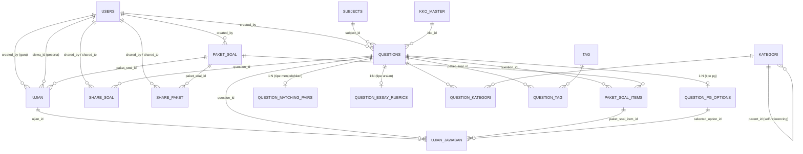

# Entity Relationship Diagram (ERD) — Bank Soal Cerdas

Skema database diturunkan langsung dari migration di `database/migrations/`. Semua tabel domain menggunakan `id` auto-increment sebagai primary key dan `timestamps()` (`created_at`, `updated_at`) kecuali disebutkan lain.

## 1. Diagram Relasi

## 2. Kamus Tabel

### `users`
| Kolom | Tipe | Keterangan |
|---|---|---|
| id | bigint PK | |
| name | string | |
| email | string, unique | |
| email_verified_at | timestamp, nullable | |
| password | string (hashed) | |
| role | enum(`admin`,`guru`,`siswa`) | default `guru` |
| is_active | boolean | default `true`; nonaktif → auto logout |
| nip | string(50), nullable, unique | khusus guru/admin |
| phone | string(20), nullable | |
| address | text, nullable | |
| gender | enum(`L`,`P`), nullable | |
| birth_date | date, nullable | |
| avatar | string, nullable | path file avatar |
| last_login_at | timestamp, nullable | |
| remember_token, timestamps | | |

### `subjects` (Mata Pelajaran)
| Kolom | Tipe | Keterangan |
|---|---|---|
| id | bigint PK | |
| name | string, unique | |
| code | string(10), nullable | |
| timestamps | | |

### `kko_master` (Kata Kerja Operasional)
| Kolom | Tipe | Keterangan |
|---|---|---|
| id | bigint PK | |
| level | enum(`L1`,`L2`,`L3`) | hasil migrasi dari `C1`–`C6` |
| bloom_level | enum(`C1`..`C6`), nullable | klasifikasi Bloom asli, index `(level, bloom_level)` |
| verb | string(100) | kata kerja operasional |
| description | text, nullable | |
| timestamps | | |

### `questions` (Soal)
| Kolom | Tipe | Keterangan |
|---|---|---|
| id | bigint PK | |
| subject_id | FK → subjects, restrict | |
| kko_id | FK → kko_master, restrict | |
| created_by | FK → users, restrict | |
| jenjang | enum(`SD`,`SMP`,`SMA`) | |
| curriculum | enum(`merdeka`,`kbc`,`both`) | |
| type | enum(`pg`,`uraian`,`menjodohkan`,`benar_salah`) | menentukan tabel detail terkait |
| level_c | enum(`L1`,`L2`,`L3`) | level kognitif (L1=LOTS, L2=MOTS, L3=HOTS) |
| question_text | text | |
| indicator_text | text, nullable | indikator soal |
| correct_boolean | boolean, nullable | jawaban untuk tipe `benar_salah` |
| deleted_at | timestamp, nullable | soft delete |
| timestamps | | |

### `question_pg_options` (Opsi Pilihan Ganda)
| Kolom | Tipe | Keterangan |
|---|---|---|
| id | bigint PK | |
| question_id | FK → questions, cascade | |
| label | char(2) | mis. "A", "B" |
| option_text | text | |
| is_correct | boolean | default `false` |
| timestamps | | |

### `question_matching_pairs` (Pasangan Menjodohkan)
| Kolom | Tipe | Keterangan |
|---|---|---|
| id | bigint PK | |
| question_id | FK → questions, cascade | |
| pair_order | integer | default `1` |
| left_text | text | |
| right_text | text | |
| timestamps | | |

### `question_essay_rubrics` (Rubrik Uraian)
| Kolom | Tipe | Keterangan |
|---|---|---|
| id | bigint PK | |
| question_id | FK → questions, cascade | |
| rubric_text | text | |
| timestamps | | |

### `kategori` (Kategori Soal, hierarkis)
| Kolom | Tipe | Keterangan |
|---|---|---|
| id | bigint PK | |
| name | string | |
| code | string, nullable | |
| description | text, nullable | |
| type | enum(`kd`,`topik`,`bab`) | default `topik` |
| parent_id | FK → kategori, cascade, nullable | self-referencing |
| timestamps | | |

### `tag`
| Kolom | Tipe | Keterangan |
|---|---|---|
| id | bigint PK | |
| name | string, unique | |
| slug | string, unique | |
| color | string | default `#6c757d` |
| timestamps | | |

### `question_kategori` / `question_tag` (pivot)
| Kolom | Tipe | Keterangan |
|---|---|---|
| id | bigint PK | |
| question_id | FK → questions, cascade | |
| kategori_id / tag_id | FK → kategori/tag, cascade | |
| timestamps | | |

### `paket_soal` (Paket Soal)
| Kolom | Tipe | Keterangan |
|---|---|---|
| id | bigint PK | |
| name | string | |
| description | text, nullable | |
| jenjang | enum(`SD`,`SMP`,`SMA`) | |
| curriculum | enum(`merdeka`,`kbc`,`both`) | |
| total_soal | integer | default `0` |
| duration_minutes | integer, nullable | |
| acak_soal | boolean | default `false` |
| acak_pilihan | boolean | default `false` |
| created_by | FK → users, restrict | |
| status | enum(`draft`,`published`,`archived`) | default `draft` |
| deleted_at | timestamp, nullable | soft delete |
| timestamps | | |

### `paket_soal_items`
| Kolom | Tipe | Keterangan |
|---|---|---|
| id | bigint PK | |
| paket_soal_id | FK → paket_soal, cascade | |
| question_id | FK → questions, cascade | |
| order | integer | default `0` |
| score | integer | default `1` |
| timestamps | | |

### `ujian` (Ujian)
| Kolom | Tipe | Keterangan |
|---|---|---|
| id | bigint PK | |
| paket_soal_id | FK → paket_soal, cascade | |
| siswa_id | FK → users, cascade | peserta ujian |
| created_by | FK → users, restrict | pembuat (guru/admin) |
| title | string | |
| description | text, nullable | |
| duration_minutes | integer, nullable | |
| total_soal | integer | default `0` |
| total_score | integer | default `0` |
| started_at / finished_at / submitted_at | timestamp, nullable | |
| status | enum(`draft`,`active`,`finished`,`expired`) | default `draft` |
| deleted_at | timestamp, nullable | soft delete |
| timestamps | | |

> Catatan: satu baris `ujian` = satu penugasan untuk satu siswa (`siswa_id` bukan pivot N:N), sehingga ujian untuk banyak peserta direpresentasikan sebagai banyak baris `ujian` yang berbagi `paket_soal_id`.

### `ujian_jawaban` (Jawaban Siswa)
| Kolom | Tipe | Keterangan |
|---|---|---|
| id | bigint PK | |
| ujian_id | FK → ujian, cascade | |
| question_id | FK → questions, cascade | |
| paket_soal_item_id | FK → paket_soal_items, cascade | |
| jawaban | text, nullable | jawaban esai/isian |
| selected_option | integer, nullable | (legacy) index opsi terpilih |
| selected_option_id | FK → question_pg_options, nullOnDelete, nullable | opsi PG terpilih |
| is_correct | boolean, nullable | |
| score | integer | default `0` |
| max_score | integer | default `1` |
| timestamps | | |

### `share_soal` / `share_paket` (Kolaborasi)
| Kolom | Tipe | Keterangan |
|---|---|---|
| id | bigint PK | |
| question_id / paket_soal_id | FK → questions/paket_soal, cascade | |
| shared_by | FK → users, cascade | pengirim |
| shared_to | FK → users, cascade | penerima |
| permission | enum(`view`,`edit`,`copy`) | default `view` |
| is_accepted | boolean | default `false` |
| accepted_at | timestamp, nullable | |
| note | text, nullable | catatan awal |
| notes | json, nullable | riwayat catatan/percakapan |
| timestamps | | |

## 3. Catatan Desain

- **Soft delete** dipakai pada `questions`, `paket_soal`, dan `ujian` agar riwayat (paket/ujian lama, hasil jawaban) tetap konsisten meski entitas induk "dihapus".
- **Level kognitif** disederhanakan dari 6 nilai Bloom (`C1`–`C6`) menjadi 3 level penyimpanan (`L1`/`L2`/`L3`) lewat migrasi data (`2026_08_21_120000_migrate_cognitive_levels_to_l1_l3.php`), sementara `kko_master.bloom_level` tetap menyimpan klasifikasi C1–C6 asli untuk pelaporan granular.
- **Tabel detail soal** (`question_pg_options`, `question_matching_pairs`, `question_essay_rubrics`) bersifat opsional dan hanya terisi sesuai `questions.type`; soal `benar_salah` tidak memakai tabel detail — jawabannya langsung di `questions.correct_boolean`.
